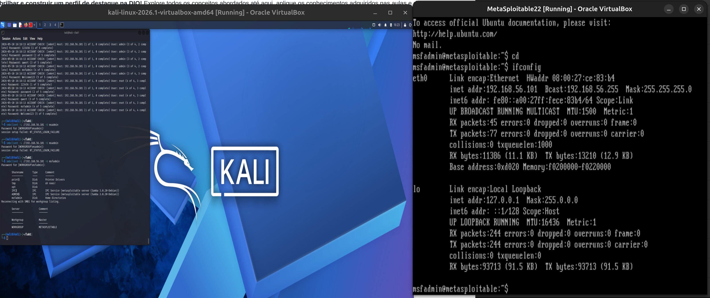
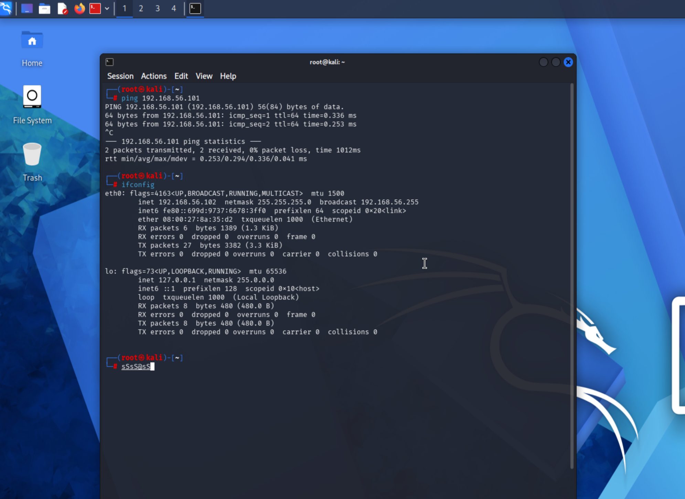
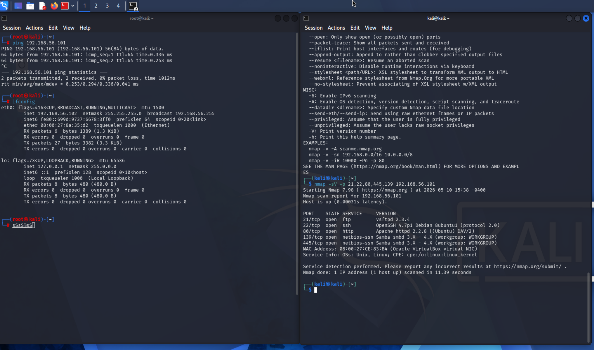
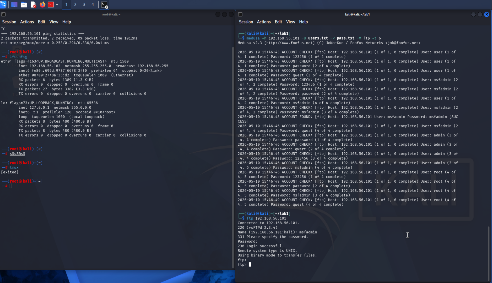
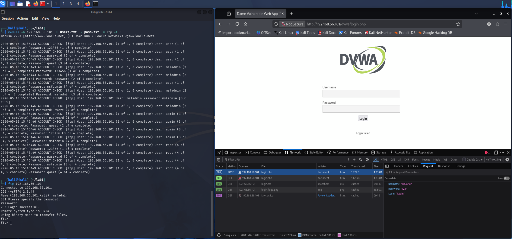
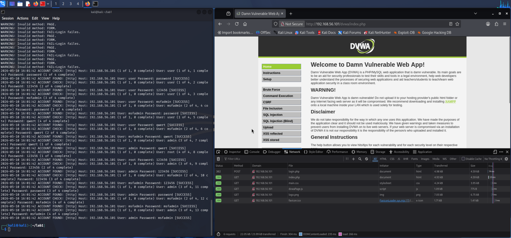
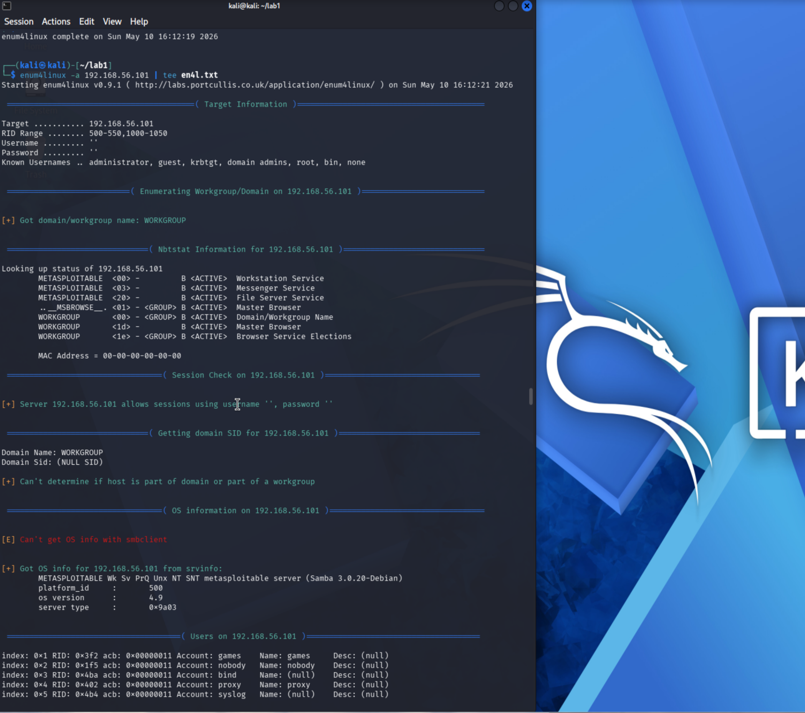
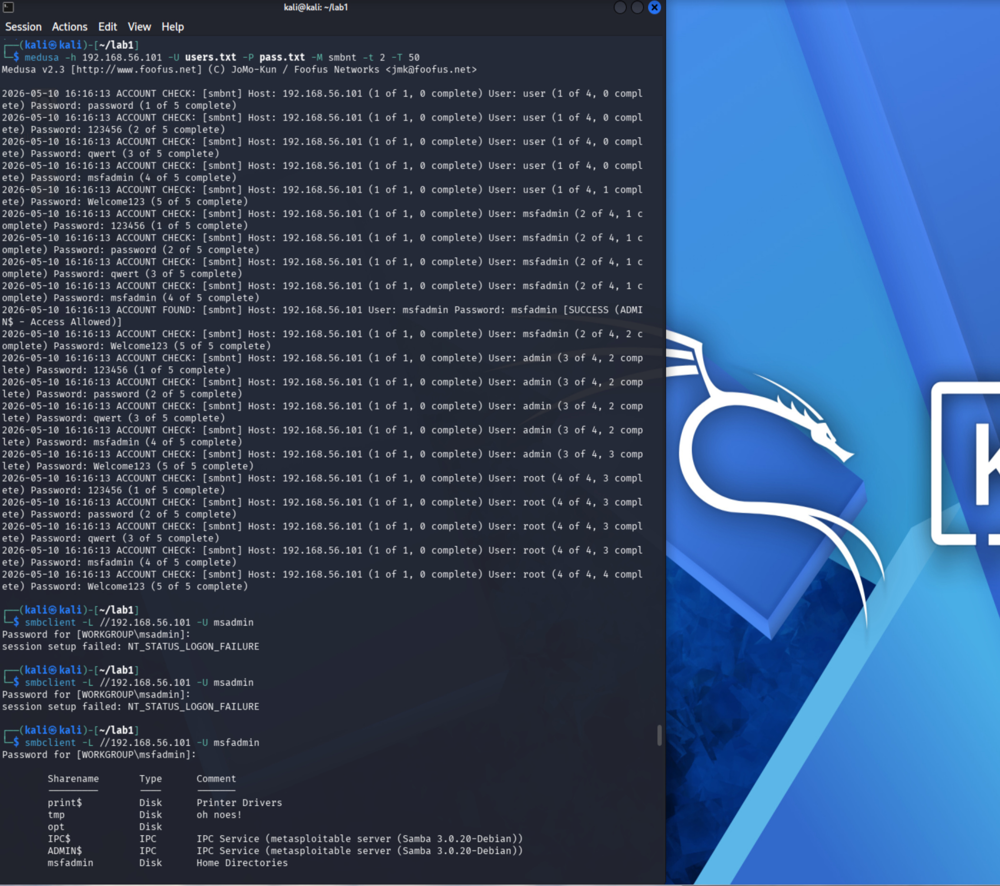

# DIO-lab2

## Configuração do ambiente

**Ambiente criado para os experimentos. Kali + Metasploitable 2.**

**Comunicação entre os dois hosts virtuais (Kali + MS)**

## Ataques simulados

**Worldlists**
- users.txt
- pass.txt

**Varredura com NMAP para detectar portas abertas no sistema (IP Metasploitable 2: 192.168.56.101)**

**Aplicando o Medusa para tentar acesso ao host MS via Brute Force. Wordlists usadas. Em seguida, testando o acesso adquirido e confirmando o Sucesso.**

**Usando o Medusa para atacar o DVWA via http:**
- Página sem criptografia SSL, deixando dados expostos.
- Tentativa de acesso foi feita usando as mesmas Worldlists e o Sucesso também foi alcançado.
- Usuário e senha obtidos pelo Medusa.
- Teste manual feito na página, confirmando os acessos.

**Agora, usando enum4linux para fazer password spraying e enumerar informações úteis, como contas e grupos, usando falhas no Samba (smb)**

**Usando Medusa para completar a invasão, onde a ferramenta vai fazer brute force em cima das Wordlists criadas com as informações do ataque anterior com o enum4linux. Posteriormente, validando os acessos adquiridos e confirmando o sucesso.**

